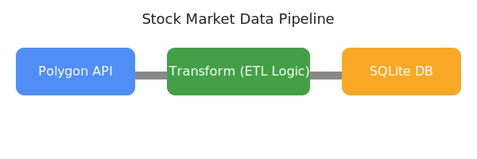

# market_data_etl
Pulling stock market data using the Polygon API, transforming this data, and then loading it into a PostgreSQL database

## Data Pipeline Design

This project implements a data pipeline to pull stock market data from the Polygon API, transform it, and load it into a PostgreSQL database. The source system is the Polygon API, and the destination is a PostgreSQL database running in Docker.

### Pipeline Overview

1. **Extract**: Pull raw stock market data from the Polygon API.
2. **Transform**: Clean, validate, and reformat the data as needed for analysis or storage.
3. **Load**: Insert the transformed data into a PostgreSQL database for further use.

#### Pipeline Diagram

**Source:** Polygon API  →  **Transform:** ETL Logic  →  **Destination:** PostgreSQL Database
